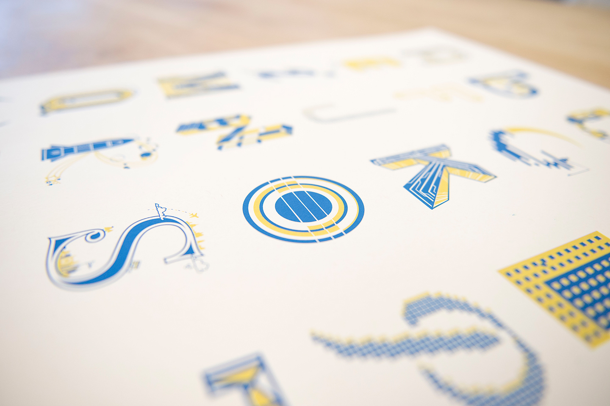

{:postcontent: .c-blog-post__content}

The chain letter project was inspired by a former designer at IBM named Cameron Sandage. The activity starts with one person designing a letter A and then forwarding it along to someone else to design the letter B and so on until the whole alphabet is done.
{: postcontent}

## Going global
{: postcontent}

During my bootcamp in the summer of 2013 Cameron started a chain letter project and I watched from the sidelines. Last year I decided to start my own. I wanted to encourage the project to reach as many IBM studios as possible, so I added a rule: you must pass it on to someone who is located in a different studio. I got to work on my letter A and sent it along to Dublin to a designer that I met in my boot camp. Then it was out of my hands until I started seeing submissions come back over the following months. I also opted to save the letter Z for Cameron so that this project would have a nice tie to his version of the chain letter.
{: postcontent}

The variety of styles was really exciting to see as I started laying out the poster and the rule to make the poster travel worked really well. This alphabet strings together IBMers in Austin, Dublin, New York, Toronto, San Francisco, Cambridge, Shanghai, RTP in North Carolina, London, Böblingen, and Poughkeepsie! But what was most striking was the variety of backgrounds of the people involved. I kept hearing “I’m not a designer…” along with a letter submission. It was unexpected, but refreshing. I met a front end developer that had never used illustrator and a researcher that said “I don’t know how to draw.” I coached a few designs along, but tried to allow each one to be its own unique creation.
{: postcontent}

## Screen printing in the Make Lab
{: postcontent}



One of the things that made me fall for IBM was the Make Lab. I am proud to work at a company that offers and emphasizes opportunities to explore creativity and backs it up with dedicated space and a modest budget. It was hugely important to me that I use the Make Lab to print these posters. Having everything to screen print available to work is such a luxury! Because of my rusty screen printing skills I did encounter a large number of setbacks that began with ripping screens, and ended with emulsion that wouldn’t adhere. The short story is that it took far too long to finish these posters, and due to work and life I wasn’t able to push through without adding more time to the process. Another thing I learned is that printing big is really hard! My registrations aren’t perfect and I wish they were, but I managed to get over that and am just so glad that I have something to share.
{: postcontent}

## 26 letters, 26 prints
{: postcontent}

So, after all of the time and effort I managed to have only 26 prints that I consider “A” quality. I intend to give one of these to each of the designers that were involved in the project. I have a few “B” quality prints that are mis-registered and will not be editioned that I’d love to sell for $10 each to help cover my expenses and shipping each designer a print. Each “B” print will be embossed with the Make Lab mark and comes with an apology from me that it is less than perfect. I still feel that these prints are enjoyable and are part of a bigger story. Hopefully that appeals to some of you. Let me know if you are interested!
{: postcontent}
